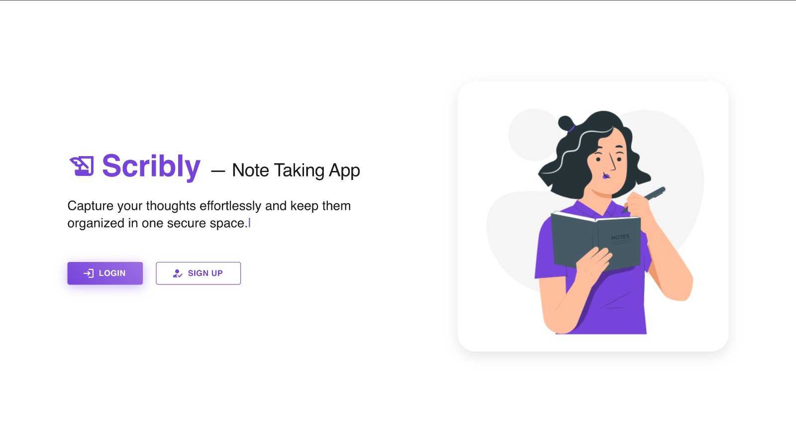
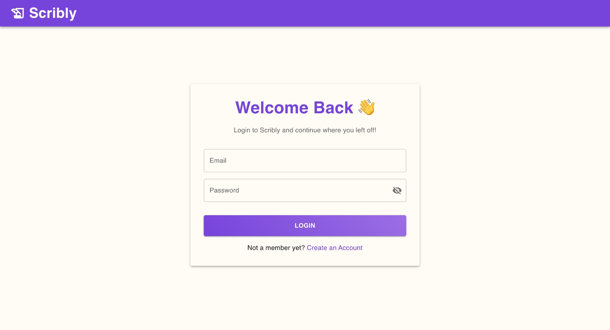
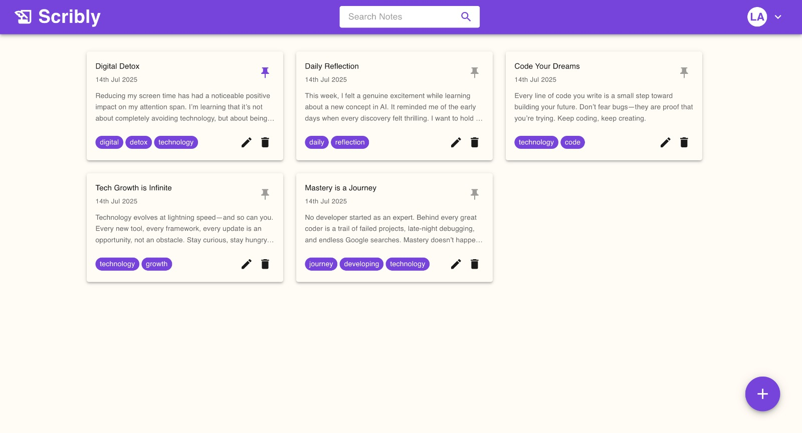

# 📒 Scribly – Note Taking App

Scribly is a clean and minimalistic note-taking web app built with the **MERN stack**, designed to help you quickly jot down, edit, and organize your notes.


## 🚀 Features

- ✅ **User Authentication** — Sign up, log in, and manage your account securely
- ✅ **Create Notes** — Write and save notes instantly
- ✅ **Edit & Delete Notes** — Update or remove notes whenever you want
- ✅ **Pin Notes** — Mark important notes by pinning them to the top
- ✅ **Search Notes** — Find your notes quickly using the search bar
- ✅ **Clean Responsive UI** — Built with **Material UI** and **Tailwind CSS** for a modern look


## Screenshots

### 📌 Landing Page


### 📌 Login Page


### 📌 Dashboard


## 🛠️ Tech Stack

**Frontend**  
- React.js
- Material UI (MUI)
- Tailwind CSS

**Backend**  
- Node.js
- Express.js

**Database**  
- MongoDB (Cloud: MongoDB Atlas)

**Other Tools**  
- React Router DOM (Routing)
- Axios (API calls)
- bcrypt.js (Password encryption)
- JSON Web Tokens (JWT Authentication)


## 📦 Installation Guide

### 🖥️ Prerequisites
- **Node.js** and **npm** installed
- **MongoDB Atlas** account (or local MongoDB instance)

### ⚙️ Clone the Repository

```bash
git clone https://github.com/lipika1911/scribly.git
cd scribly
```

### 🔌 Backend Setup

```bash
cd server
npm install
```

### 📝 Environment Variables

Create a `.env` file inside the `server` folder with the following content:

```env
MONGO_URI = your_mongodb_connection_string
ACCESS_TOKEN_SECRET = your_jwt_secret_key
```

### 🚀 Start Backend Server

To run the backend server, use the following command:

```bash
npm start
```

### 🎨 Frontend Setup

Navigate to the client folder and install dependencies:

```bash
cd ../client
npm install
```
Start the React frontend:

```bash
npm run dev
```

### ✅ You’re all set!
- Open http://localhost:3000 in your browser.
- Register a new user and start using Scribly!

### 💡 Tips:
- Make sure your backend server is running before starting the frontend.
- You can change ports in the client and server configurations if needed.

## 📄 License

This project is licensed under the [MIT License](./LICENSE).
## 👩‍💻 Author

Made with ❤️ by [@Lipika](https://github.com/lipika1911)
